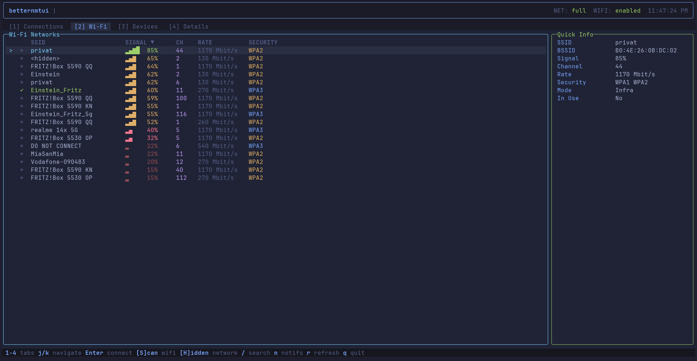

# betternmtui

A modern terminal UI for NetworkManager, built with React and [OpenTUI](https://github.com/anthropics/opentui). Manage Wi-Fi, Ethernet, and network connections without leaving the terminal.



## Features

- **Connections** -- View, toggle, edit, delete, import/export saved connections
- **Wi-Fi** -- Scan networks, connect with password prompt, join hidden SSIDs
- **Devices** -- Inspect network interfaces and their states
- **Details** -- View full connection properties with inline editing
- **Live updates** -- Polls NetworkManager for external changes automatically
- **Notifications** -- Toast messages and a persistent notification log
- **Vi-style navigation** -- `j`/`k`, `h`/`l`, `Tab`/`Shift+Tab` between panels

## Requirements

- Linux with [NetworkManager](https://networkmanager.dev/) installed (`nmcli` must be available)
- [Bun](https://bun.sh) >= 1.0.0

## Installation

```sh
bun install -g betternmtui
```

Then run:

```sh
betternmtui
```

## Run from source

```sh
git clone https://github.com/anipr2002/betternmtui.git
cd betternmtui
bun install
bun run start
```

## Keybindings

| Key | Action |
|---|---|
| `Tab` / `Shift+Tab` | Switch tabs |
| `j` / `k` or arrows | Navigate lists |
| `Enter` | Toggle connection / connect to network |
| `e` | Edit selected connection |
| `d` | Delete selected connection |
| `r` | Refresh data |
| `s` | Scan Wi-Fi networks |
| `h` | Connect to hidden network |
| `/` | Search / filter |
| `n` | Open notification log |
| `q` / `Ctrl+C` | Quit |

## Environment variables

| Variable | Default | Description |
|---|---|---|
| `NMTUI_POLL_INTERVAL` | `5000` | Polling interval in ms for connection state |
| `NMTUI_WIFI_REFRESH` | `30000` | Wi-Fi scan refresh interval in ms |

## License

[MIT](LICENSE)
